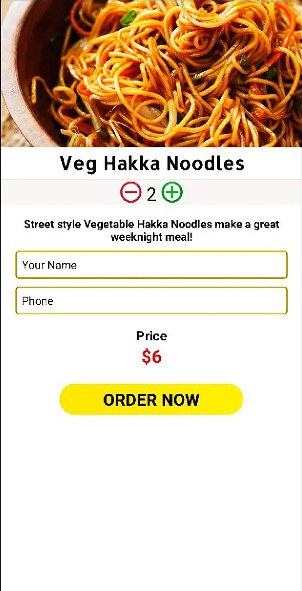

# Just Eat

## 🌟 About

Just Eat is a food ordering mobile application made using Java, XML and SQLite.
This application supports **CRUD Operations** - Create, Read, Update, and Delete.
A user can place his order which would be stored in the database, he can also update or delete his orders.

## ✨ Screenshots

## 🌟 Prerequisites
*   Android Studio 
*   Java JDK
